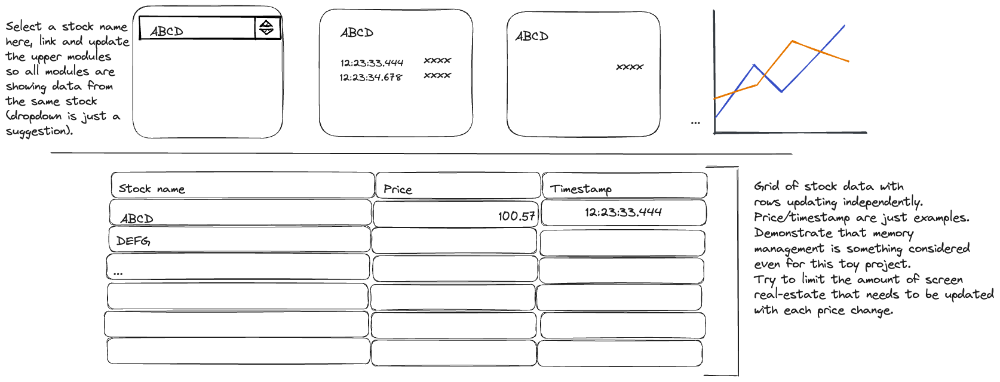

# Dashboard Coding Challenge

Your challenge is to show what you can do on a React application with some simple streaming data. We have set up a dashboard that is displaying some simple data, but we know you can make more of this.

This is intentionally open-ended. Show us the skills you want to share. If you like to make charts and graphs, do that. If you are a wizard with CSS, blow us away with your beautiful components. If you want to dig deep in the data, show us some cool math code. (There are several ideas given below). If there is something in the code that you feel should be done differently, feel free to do so. You are not meant to be limited here by any specific constraint.

## Getting Started

Fork this repo on Github and proceed by working on that.

#### Build the application

_Prerequisite: Install [Node](https://nodejs.org/en) 18+. You should have `node` and `npm` available from your command-line._

```
npm install
```

### Run the application in dev mode

```
npm run dev
```

This will start a server on your localhost (console will show the URL).

You are given a dashboard with a few simple pre-built modules. You are free to use
these as a starting point. You should make your own dashboard modules,
and improve this codebase in any way you see fit.

When you are done working on it, you can share a link to your fork, or if you prefer not to share publicly, you can zip it up (be sure to exclude the `node_modules` directory) and send it back to your hiring manager.

## Project structure

The code is written primarily with TypeScript and React.

The app compiles with Vite, and uses Prettier for formatting and ESLint for linting.

The main CSS library is TailwindCSS. Feel free to use Tailwind in your modules, or add a different styling library if you prefer.

If you are using VSCode, we suggest installing the plugins for TypeScript, ESLint, Prettier, and Tailwind. If you do, the project is already configured to make use of these tools.

## Data

There are included hooks that simulate a stream of price data for a set of stocks. (You can modify these hooks if necessary.)

`useStocks` is a hook that will return the list of stock symbols.

- `ABCD` is always given as the first one
- The rest of the list is randomly generated when you start the app.

`useStockStream` is a hook that takes a stock symbol, and returns the most recent 100 samples. For each sample, you get:

```javascript
  {
   tick: number,   // like a time stamp, but just [0, 1, 2, ...]
   value: number,  // the price of the stock
  }
```
- You can replace 'tick' with an actual timestamp

The data returned from `useStockStream` will update every second, with a new value added to the end (and the oldest removed). You can make the updates happen faster or more randomly if that helps demonstrate your code.

## Dashboard

You are given pre-built modules as examples.

- `ListStocks.tsx` simply presents a scrolling list of all the symbols
- `SingleStockModule.tsx` displays the current price for a given stock
  - The pre-built dashboard uses two of these to verify that the same data is streamed to both copies.
- `LastFiveValues.tsx` displays the most recent 5 ticks and values for a given stock.
- `EmptyModule.tsx` - Just a placeholder for filling the grid, or a starting point for new modules.

Each of the modules is built with `BaseModule.tsx` as a wrapper.

`Dashboard.tsx` is the top-level dashboard, and it is where the above modules are instantiated and sorted.

## Ideas

Again, this is open-ended, so you can design your own tasks (or your hiring manager may suggest some specific requests).

#### Layout Ideas
- Below is a generic view of a dashboard concept that is common here. Grids updating with rows of data. Drill down by individual name.
- You may want to adjust how the `useStockData` hook works (to provide independently updating events), and/or build additional data hooks that update for individual stocks.
- (1-3 hours as shown below)



#### Module ideas

- Chart data for a specific stock. Using your charting library of choice like `Visx`,
  `Victory`, `Nivo`, etc. Feel free to make modules larger on the screen than the ones
  given.  (20 minutes to 4 hours — depending on the library choice and what you do with it. You can
     drop in a simple line chart with Victory in a few minutes. Or spend more time on lower-level
     chart components from VisX and use D3 data functions to set up data scales, and various types
     of interactions.)
- Build an alerting module that shows stock values in different colors when they moves outside of a specified range. (<1 hour)
- Add the ability add and remove (and rearrange with drag-and-drop) modules from the UI. (1-2 hours)
- Build interactive modules (e.g., select 2 stocks from a list, and compare their prices.) (1 hour)

#### Data ideas

- Add some more interesting source data to the stream and display that. (? hours)
- Build some utility functions or hooks that crunch the data in interesting ways and display the results in a new module. (? hours)

#### Codebase ideas

- Add a testing library and build unit tests or end-to-end tests for any/all of the above
- Improve the state management. The `useStockStream` hook is built with a hacky workaround to avoid using a real state-management library. Add in `Redux` or `Recoil` or something else and build it better. (1-2 hours)
